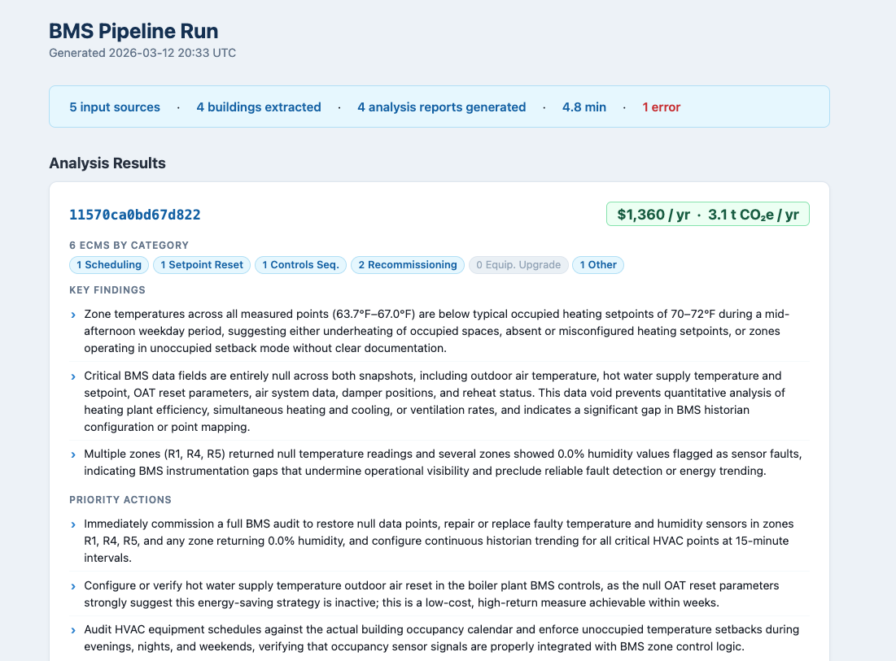
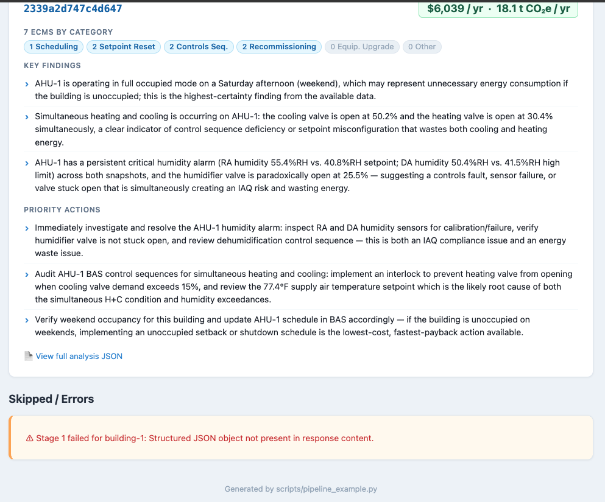

# Purpose

> In this exercise, you will build a prototype pipeline that ingests screenshots from real BMS interfaces, extracts structured information, and uses that information to identify potential energy efficiency opportunities.

# Getting Started
## Setting Up Your Environment
> [!NOTE]
> This code was built and tested on a MacBook Pro, 14-inch, 2023 model, running MacOS Tahoe 26.2. Default terminal assumed is `bash` and code is all python. If you do not have access to a Linux/Unix-based system, please note that some of these commands may require modification. Links to multi-platform installation instructions are provided whenever possible.

1. Install `pyenv` to manage python versions (instructions [here](https://github.com/pyenv/pyenv?tab=readme-ov-file#installation)). 
    * In truth, any approach that gets python 3.12.10 installed will replicate what I did here, but pyenv is a great tool to have!
2. Install `uv` for python package management and environment replication (instructions [here](https://docs.astral.sh/uv/getting-started/installation/)).   
    * The `uv`-recommended path is to use their direct installation path via things like `curl`, but I prefer (on a Mac) to use `homebrew` (it's in the linked instructions if you want to do that too)
3. Run `uv sync` from your terminal to ensure you get all the packages installed in a virtual environment on your machine.
4. Create a directory `data/images/` in the repo root and put inside it the various images (including folders of images, e.g. `building-1/`) that you want to use as input. Please put all the images in there so the example script is able to find the subset it runs for a demo.


## Running the code
Run the end-to-end pipeline example with:

```bash
uv run scripts/pipeline_example.py
```

This script (which should take around 3-5 minutes to complete) runs both pipeline stages on a demo set of inputs:

- **Stage 1** — sends each image to the Claude API and extracts a structured BMS snapshot JSON for each timestamp of data observed in the image. This may result in 0 JSONs being output (when no useful data are observed), 1, or as many as there are timestamps (e.g. an alerts summary page may show 10 alerts each with a different timestamp, resulting in 10 JSON files).
- **Stage 2** — analyses each building's snapshots to identify energy conservation measures (ECMs) and estimate savings as well as next steps and considerations for the customer.

The demo inputs are 4 individual BMS screenshots plus all images under `data/images/building-1/` (treated as one building).

When the run finishes, the terminal prints the path to an HTML report saved under `logs/`. Open it in any browser to see a summary of each building: estimated cost and CO₂ savings, ECM counts by category, key findings, priority actions, and a link to the full analysis JSON.

# Deliverables
As requested, please find information about the deliverables specified in the assignment below (beyond this README itself).

## Sample Output

After running the pipeline_example script, you should get a log produced that gives you the results of your run (the terminal will print out a path to the file it generated but you can also find it in `logs/`). This will be an HTML file you can simply double-click on most machines to open up in your browser of choice. An example is below:




## Design Document
Please see the [Design Document](references/design_notes.md) for details on how I structured this project and the other information requested.